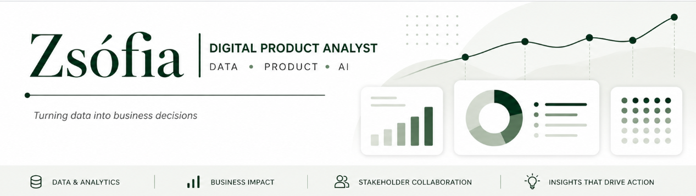

 

Soy **Digital Product Analyst** con experiencia en datos, customer experience y operaciones, trabajando en entornos donde el análisis tiene impacto directo en decisiones de negocio. Colaboro con distintos equipos y stakeholders para entender problemas, definir métricas clave y transformar datos en acciones concretas que mejoren productos y resultados. Trabajo con datos reales para analizar el comportamiento de usuarios, optimizar procesos y apoyar decisiones estratégicas basadas en evidencia. 

Este perfil combina **proyectos profesionales** (anonimizados) y **proyectos formativos** con un enfoque práctico y educativo. 

  

## Sobre este repositorio 
Este portfolio tiene también un objetivo educativo. 

Aquí documento proyectos y ejemplos para ayudar a otros perfiles a: 
- Entender cómo construir un portfolio en data
- Ver casos prácticos reales
- Aprender a enfocar proyectos hacia negocio

 

## Herramientas en entorno profesional

- **Data & Querying:** Snowflake, SQL  
- **Análisis & scripting:** Python (Jupyter Notebooks)  
- **Visualización:** Power BI  
- **Analítica digital:** Google Analytics, Google Tag Manager  
- **Automatización / AI:** Copilot Studio  

 

## Cómo trabajo

- Empiezo por el **problema de negocio**, no por la herramienta  
- Trabajo con **datos imperfectos** y escenarios reales  
- Priorizo **claridad y aplicabilidad** sobre complejidad técnica  
- Comunico resultados de forma **estructurada y accionable**  

 

## Proyectos destacados

### 01. Proyecto Jupiter — Análisis de inversión inmobiliaria

Proyecto final de máster (PontIA)

- Análisis de mercado inmobiliario en destinos turísticos en España  
- Integración de múltiples fuentes de datos  
- Identificación de variables clave en **precio, rentabilidad y estacionalidad**  
- Recomendaciones estratégicas para inversión de **300M€**  

**Stack:** Python, Pandas, Web Scraping, Power BI  

🔗 [Ver proyecto Jupiter](https://github.com/zsofiaKad/AnalyticsPortfolio/tree/main/01.%20Master's%20final%20project)

 

### 02. Excursion Sales & Cancellation Analysis

Caso basado en entorno real profesional (**datos anonimizados**)

- Análisis de cancelaciones y su impacto en ingresos  
- Identificación de patrones temporales y operativos  
- Creación de dashboard para toma de decisiones  

**Stack:** Snowflake, SQL, Power BI  

🔗 [Ver proyecto Sales & Cancellations Analysis](https://github.com/zsofiaKad/AnalyticsPortfolio/tree/main/04.%20Power%20BI/Sales%20performance)

 

### 03. K-Pop Data Analysis Challenge (2º puesto)

- Análisis de tendencias de éxito en la industria K-pop  
- Identificación de patrones para expansión en España y LATAM  
- Presentación de resultados en formato storytelling  

**Stack:** Python, Pandas, EDA  

🔗 [Ver proyecto EDA](https://github.com/zsofiaKad/AnalyticsPortfolio/tree/main/02.%20Python/Python%20Challange%20EDA)

 

### 04. SQL Marketing Data Analysis

- Análisis de tráfico, conversión y funnel  
- A/B testing y performance de landing pages  
- Análisis de canales y comportamiento de usuarios  

**Stack:** SQL (MySQL)  

🔗 [Ver proyecto Digital Marketing](https://github.com/zsofiaKad/AnalyticsPortfolio/tree/main/03.%20SQL/Digital_Marketing_Analysis_Advanced_SQL)

 

## Contacto

- GitHub: https://github.com/zsofiaKad  
- LinkedIn: <*link*>
